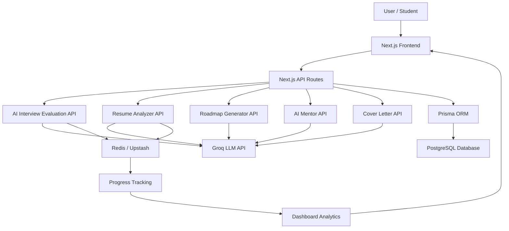

# MeetSync – Secure Real-Time Video Conferencing Platform

MeetSync is a full-stack real-time video conferencing and collaboration platform built with the MERN stack, WebRTC, Socket.io, and JWT authentication.
It allows users to create and join secure meeting rooms, communicate through real-time audio/video calls, chat instantly, share screens, record meetings, use a collaborative whiteboard, and monitor WebRTC connection diagnostics.

This project is built as a production-style real-time communication platform to demonstrate strong skills in WebRTC, Socket.io, full-stack development, real-time collaboration, authentication, and modern UI/UX design.

---

## Live Demo

**Live Project:** https://meetsync-secure-webrtc-video.onrender.com/
**GitHub Repository:** https://github.com/hariom-p1306/MeetSync-Secure-WebRTC-Video-Conferencing

---

## Key Highlights

* Built a secure real-time video conferencing platform using **WebRTC peer-to-peer communication**.
* Implemented **Socket.io signaling** for WebRTC offer/answer exchange and ICE candidate handling.
* Added real-time collaboration tools including **chat, screen sharing, recording, diagnostics panel, and whiteboard**.
* Designed a modern responsive UI for landing page, authentication, dashboard, lobby, meeting room, and history page.
* Implemented user authentication and meeting history using **JWT, Node.js, Express.js, and MongoDB**.
* Improved screen sharing flow using **replaceTrack()** to switch between camera and screen stream smoothly.

---

## Tech Stack

### Frontend

* React.js
* JavaScript
* Material UI
* CSS Modules
* WebRTC APIs
* MediaRecorder API
* Canvas API
* Socket.io Client

### Backend

* Node.js
* Express.js
* MongoDB
* Mongoose
* Socket.io
* JWT Authentication
* REST APIs

### Core APIs and Concepts

* WebRTC Peer Connection
* SDP Offer/Answer Exchange
* ICE Candidate Handling
* MediaStream API
* Screen Sharing using `getDisplayMedia()`
* Stream switching using `replaceTrack()`
* Meeting recording using `MediaRecorder`
* Real-time drawing using Canvas API and Socket.io

---

## Features

### Secure Authentication

* User registration and login
* JWT-based authentication
* Protected user-specific routes
* User meeting history tracking

### Meeting Rooms

* Create and join meeting rooms using unique room codes
* Shareable meeting links
* Lobby screen before joining a meeting
* Camera preview before entering the room
* Participant count display

### Real-Time Video Conferencing

* WebRTC-based audio and video calling
* Peer-to-peer media streaming
* Socket.io signaling server
* Participant join and leave handling
* Local and remote video stream rendering

### Screen Sharing

* Screen sharing using `navigator.mediaDevices.getDisplayMedia()`
* Improved stream switching using WebRTC `replaceTrack()`
* Restores camera stream when screen sharing stops
* Prevents unnecessary peer reconnection during screen share toggle

### Real-Time Chat

* Room-based chat system
* Instant message broadcasting using Socket.io
* Message timestamps
* Empty state for chat panel
* Unread message badge

### Meeting Recording

* Browser-based meeting recording using MediaRecorder API
* Start and stop recording from meeting controls
* Download recorded session as `.webm`
* Recording status indicator in meeting room

### WebRTC Diagnostics Panel

* Connection state monitoring
* ICE connection state tracking
* Participant count
* Mic status
* Camera status
* Screen sharing status
* Recording status

### Collaborative Whiteboard

* Real-time whiteboard built using Canvas API
* Room-based drawing synchronization using Socket.io
* Clear whiteboard option
* Useful for explanations, planning, and live collaboration

### Meeting History

* Stores previously joined meeting rooms
* Rejoin meetings from history
* Modern history dashboard with meeting cards
* Empty state handling

### Modern UI/UX

* Rebranded from a basic video call app to **MeetSync**
* Professional SaaS-style landing page
* Clean authentication page
* Improved post-login dashboard
* Modern meeting lobby
* Premium meeting room layout
* Responsive design for different screen sizes

---


## Architecture Diagram



### Architecture Overview

PlacementPrep AI follows a full-stack AI-powered architecture built around Next.js API Routes, LLM-based evaluation, Redis/Upstash caching, Prisma ORM, and PostgreSQL persistence.

The user interacts with the Next.js frontend, where they can access AI interview practice, resume analysis, roadmap generation, AI mentor support, and cover letter generation. Each feature communicates with dedicated Next.js API routes, which process user input and interact with the Groq LLM API to generate intelligent responses, feedback, scores, and recommendations.

Redis/Upstash is used for fast temporary data handling, progress tracking, and improving response flow for AI-based modules. Prisma ORM manages structured database operations, while PostgreSQL stores persistent user data, interview sessions, resume analysis results, progress records, and dashboard analytics.

This architecture makes the platform modular, scalable, and suitable for real-world interview preparation workflows.


## Project Architecture

```txt
MeetSync
│
├── Frontend
│   ├── src
│   │   ├── pages
│   │   │   ├── landing.jsx
│   │   │   ├── authentication.jsx
│   │   │   ├── home.jsx
│   │   │   ├── history.jsx
│   │   │   └── VideoMeet.jsx
│   │   │
│   │   ├── contexts
│   │   │   └── AuthContext.jsx
│   │   │
│   │   ├── styles
│   │   │   └── videoComponent.module.css
│   │   │
│   │   ├── utils
│   │   │   └── withAuth.jsx
│   │   │
│   │   ├── App.jsx
│   │   ├── App.css
│   │   └── environment.jsx
│
├── Backend
│   ├── src
│   │   ├── app.js
│   │   ├── controllers
│   │   │   ├── socketManager.js
│   │   │   └── user.controller.js
│   │   │
│   │   ├── models
│   │   │   ├── user.model.js
│   │   │   └── meeting.model.js
│   │   │
│   │   └── routes
│   │       └── users.routes.js
```

---

## How WebRTC Works in MeetSync

MeetSync uses WebRTC for peer-to-peer audio/video communication. Since WebRTC needs a signaling mechanism before peers can connect, Socket.io is used as the signaling layer.

### Flow

```txt
User joins room
↓
Socket.io joins user to room
↓
Peer connection is created
↓
SDP offer/answer is exchanged
↓
ICE candidates are exchanged
↓
WebRTC peer-to-peer media connection is established
↓
Audio/video streams flow directly between users
```

---

## Socket.io Events

### WebRTC Signaling

* `join-call`
* `signal`
* `user-joined`
* `user-left`

### Chat

* `chat-message`

### Whiteboard

* `whiteboard-draw`
* `whiteboard-clear`

---

## Advanced Features Implemented

### 1. Screen Sharing with `replaceTrack()`

Instead of reconnecting the peer connection, MeetSync replaces the active camera video track with the screen video track.

```txt
Camera stream
↓
User starts screen share
↓
Screen stream captured
↓
Video track replaced using replaceTrack()
↓
User stops screen share
↓
Camera stream restored
```

This improves the meeting experience by avoiding unnecessary reconnection during screen sharing.

---

### 2. Meeting Recording with MediaRecorder API

MeetSync records the active local media stream using the browser’s MediaRecorder API and allows users to download the recording.

```txt
Start Recording
↓
Capture active media stream
↓
Store recorded chunks
↓
Stop Recording
↓
Generate downloadable .webm file
```

---

### 3. WebRTC Diagnostics Panel

The diagnostics panel helps monitor the current meeting state and WebRTC connection health.

It displays:

* Connection state
* ICE state
* Participant count
* Mic status
* Camera status
* Screen sharing status
* Recording status

---

### 4. Collaborative Whiteboard

The whiteboard uses Canvas API for drawing and Socket.io for real-time synchronization.

```txt
User draws on canvas
↓
Coordinates are emitted through Socket.io
↓
Backend broadcasts drawing data to other users in the same room
↓
Other users see the drawing in real time
```

---

## Installation and Setup

### 1. Clone the Repository

```bash
git clone https://github.com/hariom-p1306/MeetSync-Secure-WebRTC-Video-Conferencing.git
cd MeetSync-Secure-WebRTC-Video-Conferencing
```

---

## Backend Setup

```bash
cd Backend
npm install
```

Create a `.env` file inside the Backend folder:

```env
PORT=8000
MONGO_URL=your_mongodb_connection_string
JWT_SECRET=your_jwt_secret
```

Run the backend:

```bash
npm start
```

Or for development:

```bash
npm run dev
```

---

## Frontend Setup

```bash
cd Frontend
npm install
npm run dev
```

Update the backend URL inside:

```txt
Frontend/src/environment.jsx
```

Example:

```js
const server = "http://localhost:8000";
export default server;
```

For deployed frontend, replace it with deployed backend URL.

---

## Environment Variables

### Backend

```env
PORT=8000
MONGO_URL=your_mongodb_connection_string
JWT_SECRET=your_jwt_secret
```

### Frontend

Update:

```js
const server = "your_backend_url";
export default server;
```

---

## Resume Impact

This project demonstrates:

* Real-time communication engineering
* WebRTC peer-to-peer media handling
* Socket.io signaling and room-based broadcasting
* Full-stack MERN development
* JWT authentication
* Real-time collaboration features
* Media recording and screen sharing
* Modern frontend UI/UX design
* Production-style project structuring

---

## Resume Project Description

```txt
MeetSync – Real-Time Video Conferencing and Collaboration Platform

Built and deployed a secure WebRTC-based video conferencing platform with real-time audio/video calls, meeting rooms, chat, screen sharing, recording, and meeting history.

Implemented Socket.io signaling for offer/answer exchange, ICE candidate handling, participant events, and room-based real-time communication.

Added collaboration features including Canvas API whiteboard, MediaRecorder recording, shareable room links, and WebRTC diagnostics panel.
```

---

## Future Improvements

* Add TURN server support for better NAT traversal
* Add host controls and waiting room approval
* Add persistent whiteboard history
* Add meeting analytics such as duration and participant activity
* Add cloud recording support
* Add TypeScript migration for safer Socket.io and WebRTC event handling
* Add CI/CD workflow for automated deployment

---

## Author

**Hariom Patel**
Full Stack Developer | MERN Stack | WebRTC | Real-Time Applications

* GitHub: https://github.com/hariom-p1306
* LinkedIn: https://www.linkedin.com/in/hariom-patel-dev/
