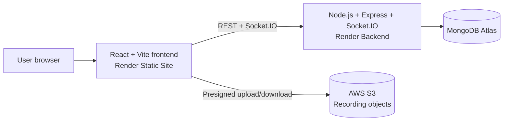
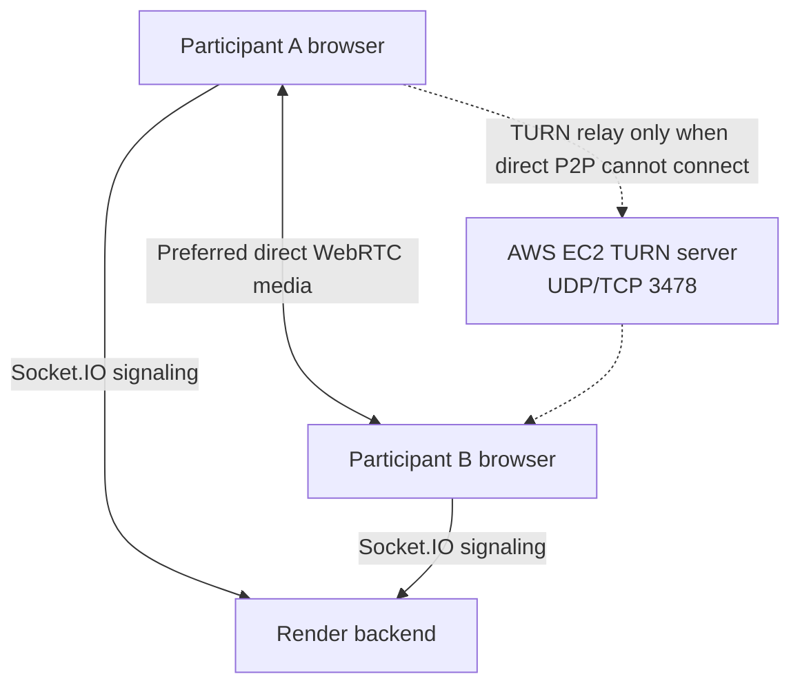

# MeetSync - Secure Real-Time Video Conferencing Platform

MeetSync is a full-stack video conferencing and collaboration application. Users can create or join shareable meeting rooms, communicate with WebRTC audio/video, chat in real time, share their screen, draw on a shared whiteboard, and record their local media stream.

The project focuses on the practical pieces behind a browser-based meeting experience: WebRTC peer connections, Socket.IO signaling, room events, MongoDB-backed meeting history, and a TURN relay fallback for difficult network conditions.

## Live Demo

Frontend: https://meetsync-secure-webrtc-video.onrender.com/

## GitHub Repository

https://github.com/hariom-p1306/MeetSync-Secure-WebRTC-Video-Conferencing

## Key Highlights

- React and Vite single-page frontend with responsive Material UI/CSS styling.
- WebRTC peer-to-peer audio/video calls with Socket.IO signaling.
- Google STUN plus TURN fallback for participants behind restrictive NAT or firewall rules.
- Shareable room URLs, participant join/leave events, and meeting history.
- Screen sharing without recreating peer connections by using `replaceTrack()`.
- Room chat and collaborative Canvas whiteboard synchronized over Socket.IO.
- Browser recording with MediaRecorder, local `.webm` download, and S3 presigned upload/download support.
- Registration/login with bcrypt password hashing and a server-generated, database-backed access token.

## Tech Stack

| Area | Technologies |
| --- | --- |
| Frontend | React, Vite, JavaScript, React Router, Material UI, CSS Modules |
| Backend | Node.js, Express.js, Socket.IO, REST endpoints |
| Data | MongoDB, Mongoose |
| Real-time media | WebRTC, `RTCPeerConnection`, MediaStream, SDP, ICE |
| Browser APIs | `getUserMedia`, `getDisplayMedia`, `MediaRecorder`, Canvas API |
| File storage | AWS S3 with presigned upload/download URLs |
| Deployment | Render Static Site, Render backend service, MongoDB Atlas, AWS EC2 TURN server |

## Features

### Authentication and history

- User registration and login.
- Password hashing with bcrypt.
- Server-generated access token stored against the user record.
- User-specific meeting-history endpoints for saving and retrieving joined rooms.

### Meeting rooms and real-time calling

- Create or join a meeting through a shareable room URL.
- Camera/microphone preview and in-call controls.
- WebRTC peer-to-peer audio/video streams.
- Socket.IO signaling for SDP offer/answer and ICE candidate exchange.
- Participant join and leave handling.
- Connection and ICE-state diagnostics in the meeting UI.

### Collaboration tools

- Real-time room chat.
- Screen sharing through `getDisplayMedia()`.
- Camera-to-screen and screen-to-camera switching through `RTCRtpSender.replaceTrack()`.
- Collaborative Canvas whiteboard with room-scoped drawing and clear events.
- MediaRecorder-based recording of the current local media stream.
- Download local recordings as `.webm` files.
- Upload/download recording files through short-lived S3 presigned URLs.

## Architecture Diagram



### WebRTC media path



## Architecture Overview

The React/Vite frontend handles the meeting UI, browser permissions, media capture, peer connections, screen sharing, recording, and whiteboard rendering. It connects to the Node.js backend through REST endpoints and Socket.IO.

The Express/Socket.IO backend manages user routes, meeting-history persistence, room membership events, signaling-message relay, chat broadcasts, whiteboard broadcasts, and recording presigned URL endpoints. MongoDB Atlas stores application data through Mongoose. AWS S3 stores uploaded recording objects.

The signaling server helps browsers exchange connection setup messages. It does not carry ordinary WebRTC audio/video when a direct peer-to-peer path is available.

## How WebRTC Works in MeetSync

1. A participant opens a meeting URL and the browser requests camera/microphone access.
2. The frontend joins a Socket.IO room.
3. When another participant joins, the browsers create `RTCPeerConnection` objects.
4. Socket.IO relays SDP offers, answers, and ICE candidates between participants.
5. ICE first attempts a direct peer-to-peer media path, assisted by STUN discovery.
6. If direct connectivity is blocked by NAT or firewall rules, the configured AWS EC2 TURN server relays the media as a fallback over UDP/TCP port `3478`.
7. Once connected, audio/video media flows through WebRTC while Socket.IO continues to handle signaling and collaboration events.

TURN credentials, private keys, and other deployment secrets are intentionally not documented here.

## Socket.IO Events

| Event | Purpose |
| --- | --- |
| `join-call` | Adds a socket to a meeting room. |
| `user-joined` | Notifies room members that a participant joined. |
| `signal` | Relays SDP or ICE signaling data to another participant. |
| `user-left` | Notifies room members that a participant disconnected. |
| `chat-message` | Broadcasts a chat message inside a room. |
| `whiteboard-draw` | Broadcasts drawing coordinates and style data. |
| `whiteboard-clear` | Clears the room whiteboard. |

## Advanced Technical Features

### Screen sharing with `replaceTrack()`

When screen sharing starts, MeetSync gets a display stream through `getDisplayMedia()`. Instead of destroying and recreating every peer connection, it replaces the current video sender track with the screen track. When sharing ends, it restores the camera track. This keeps the existing WebRTC connection alive and avoids unnecessary reconnection.

### Recording and storage

The browser uses `MediaRecorder` on the current local media stream and creates a `.webm` blob when recording stops. The user can download that local recording. The frontend can also request a short-lived S3 upload URL from the backend and upload the blob directly to S3; later it can request a signed download URL.


### Collaborative whiteboard

The UI draws locally using Canvas API. Drawing coordinates are emitted through Socket.IO, and the backend broadcasts them to other sockets in the same room so participants see updates in real time.

## Deployment and Infrastructure

| Service | Role |
| --- | --- |
| Render Static Site | Hosts the built React/Vite frontend. |
| Render Web Service | Runs the Node.js, Express, and Socket.IO backend. |
| MongoDB Atlas | Hosts the MongoDB database used by Mongoose. |
| AWS EC2 TURN server | Provides a WebRTC relay fallback for NAT/firewall-restricted connections on UDP/TCP port `3478`. |
| AWS S3 | Stores uploaded recording files through presigned URLs. |

### SPA refresh requirement on Render

MeetSync uses React Router meeting URLs such as `/123`. For a Render Static Site, configure this rewrite rule in **Redirects/Rewrites**:

| Source Path | Destination Path | Action |
| --- | --- | --- |
| `/*` | `/index.html` | `Rewrite` |

This makes Render serve the React entry file for client-side routes on refresh, while preserving the visible meeting URL.

## Installation and Local Setup

### Prerequisites

- Node.js 18 or newer
- A MongoDB Atlas database (or another MongoDB instance)
- Valid backend environment variables

### 1. Clone the repository

```bash
git clone https://github.com/hariom-p1306/MeetSync-Secure-WebRTC-Video-Conferencing.git
cd MeetSync-Secure-WebRTC-Video-Conferencing
```

### 2. Start the backend

```bash
cd Backend
npm install
npm run dev
```

The backend uses `PORT` when set, otherwise it listens on port `8000`.

### 3. Start the frontend

Open a second terminal:

```bash
cd Frontend
npm install
npm run dev
```

For local development, the frontend API configuration should point to `http://localhost:8000`. Keep the `/api/v1/users` prefix unchanged.

## Environment Variables

Create `Backend/.env` locally. Do not commit this file or share its values.

| Variable | Purpose |
| --- | --- |
| `PORT` | Optional backend port; defaults to `8000`. |
| `MONGO_URL` | MongoDB connection string. |
| `AWS_REGION` | Region used by the S3 client. |
| `AWS_ACCESS_KEY_ID` | Server-side AWS credential identifier for S3 operations. |
| `AWS_SECRET_ACCESS_KEY` | Server-side AWS secret for S3 operations. |
| `AWS_S3_BUCKET_NAME` | S3 bucket used for recording objects. |

Never place database credentials, AWS secrets, TURN credentials, or private keys in frontend code, Git history, or public documentation.

## Resume Project Description

**MeetSync - Real-Time Video Conferencing and Collaboration Platform**

Built a full-stack WebRTC video conferencing application using React/Vite, Node.js, Express, Socket.IO, MongoDB, and Mongoose. Implemented room-based signaling, peer-to-peer calls with TURN fallback, screen sharing through `replaceTrack()`, real-time chat, Canvas whiteboard synchronization, local `.webm` recording, meeting history, and S3 presigned recording uploads.

## Future Improvements

- Add host controls, waiting-room approval, and room-level authorization.
- Persist whiteboard history and chat history in the database.
- Add automated tests for authentication, REST routes, Socket.IO events, and WebRTC flows.
- Improve multi-party call scalability with an SFU architecture when usage requires it.
- Add meeting analytics such as duration, participant activity, and connection-quality reporting.
- Move hard-coded client-side deployment values into environment-based configuration.

## Author

Hariom Patel - Full-Stack Developer

- GitHub: https://github.com/hariom-p1306
- LinkedIn: https://www.linkedin.com/in/hariom-patel-dev/
